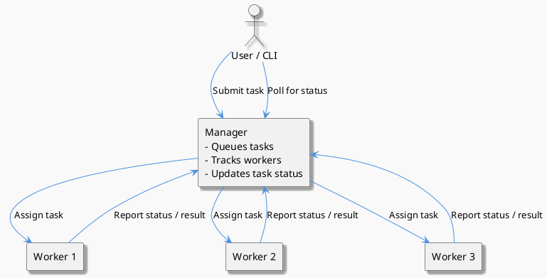

# Remote Shell

(By design)

A distributed computing project with one manager and many workers. The manager schedules tasks to available workers,
which execute commands and return results.

---

## Features

Workers register autonomously (ie by scaling up replicas).
The manager uses round-robin algorithm to distribute executions.
The worker reports the state of its executions to the manager on change.
The user submits an execution either via the HTTP endpoints of the manager, or uses the python CLI provided.
Then the user polls continuously to get updates for their executions.
Once the computation finished (either by completion or via an error) the user gets to see the result of their
computation.

The user may specify their required computing power in terms of CPUs and RAM at task submission.
The scheduling algorithm then disregards all workers that do not satisfy the users specifications.

---

## Architecture



Both the manager and worker are written using Java Spring Boot.
The CLI is written in python.

---

## CLI

Run the python script found in cli/main.py with the following arguments.

`python cli/main.py [MANAGER_HOST] "[SHELL_COMMAND]"`

If your shell command contains spaces or special characters, wrap it in quotation marks.
The CLI defaults to using one CPU core, 128MB of memory and a timeout of 30 seconds, which can be overwritten using the
arguments `--cpu`, `--memory` `--timeout`.

Example:

```log
~/workspace/remote-shell/cli » python main.py http://localhost:8080 "python -c 'import random; print(f\"Random number: {random.randint(1,100)}\")'"
Submitting task: 'python -c 'import random; print(f"Random number: {random.randint(1,100)}")'' with CPU=1, Memory=128MB
Task submitted with executionId: 22b4a28e-0e59-4d89-bf65-cf98755c08bf
Polling for task completion...
Status: QUEUED
Status: FINISHED
Task finished
Result: Random number: 50
```

```log
~/workspace/remote-shell/cli » python main.py http://localhost:8080 "python -c 'import time; import random; time.sleep(5); print(f\"Random number after delay: {random.randint(1,100)}\")'"
Submitting task: 'python -c 'import time; import random; time.sleep(5); print(f"Random number after delay: {random.randint(1,100)}")'' with CPU=1, Memory=128MB
Task submitted with executionId: 9972513d-8a95-4c62-b395-021d330485d2
Polling for task completion...
Status: QUEUED
Status: IN_PROGRESS
Status: IN_PROGRESS
Status: IN_PROGRESS
Status: IN_PROGRESS
Status: IN_PROGRESS
Status: FINISHED
Task finished
Result: Random number after delay: 79
```

---

## Endpoints

The system exposes REST endpoints for both users and workers.
The managers OpenAPI specification can be found under http://manager-url/v3/api-docs; the SwaggerUi
under http://manager-url/swagger-ui.html

### User / Client Endpoints

- `POST /task/submit`  
  Submit a command for execution. You can specify CPU and memory requirements. Returns an execution ID and initial
  status.

- `GET /task/{executionId}`  
  Poll the manager for the current status of a task. Returns `QUEUED`, `IN_PROGRESS`, `FINISHED`, or `FAILED` along with
  result or error if available.

- `GET /task/all`  
  Retrieve all tasks submitted to the manager.

### Worker Endpoints

- `POST /worker/register`  
  Workers register themselves with the manager, providing their base URL and capacity.

- `POST /worker/deregister/{workerId}`  
  Workers can deregister themselves.

- `GET /worker/list`  
  Get a list of all registered workers.

- `GET /worker/available`  
  Get a list of available workers.

- `PUT /worker/execution/{executionId}/status`  
  Workers update the status of a task (`QUEUED`, `IN_PROGRESS`, `FINISHED`, `FAILED`) and optionally provide a result or
  error message.

---

## Security & Deployment## Security & Deployment

This setup allows arbitrary code execution, so take care when deploying.  
Execution submissions from the manager to workers are guarded by `WORKER_SECRET`, which **must be overwritten in
production**. 
The goal is to secure only the manager, leaving workers to be trusted via the secret.

Common environment variables to configure in a deployed setup:

| Component | Variable         | Example Value         | Description                                       |
|-----------|------------------|-----------------------|---------------------------------------------------|
| Manager   | SERVER_PORT      | 8080                  | Port the manager listens on                       |
| Manager   | WORKER_SECRET    | s3cr3tKey             | Secret token for authenticating workers           |
| Worker    | SERVER_PORT      | 8081                  | Port the worker listens on                        |
| Worker    | WORKER_ID        | worker-1              | Unique identifier for the worker                  |
| Worker    | WORKER_BASE_URL  | http://localhost:8081 | Base URL of the worker                            |
| Worker    | MANAGER_URL      | http://localhost:8080 | URL of the manager to connect to                  |
| Worker    | WORKER_CPU_COUNT | 4                     | Number of CPUs the worker can use                 |
| Worker    | WORKER_MEMORY_MB | 2048                  | Memory in MB available to the worker              |
| Worker    | WORKER_SECRET    | s3cr3tKey             | Secret token matching the manager’s WORKER_SECRET |

--- 

## Build & Tests

The project uses maven as build system. 
Run tests using `mvn test`.
Run tests and package `mvn package`